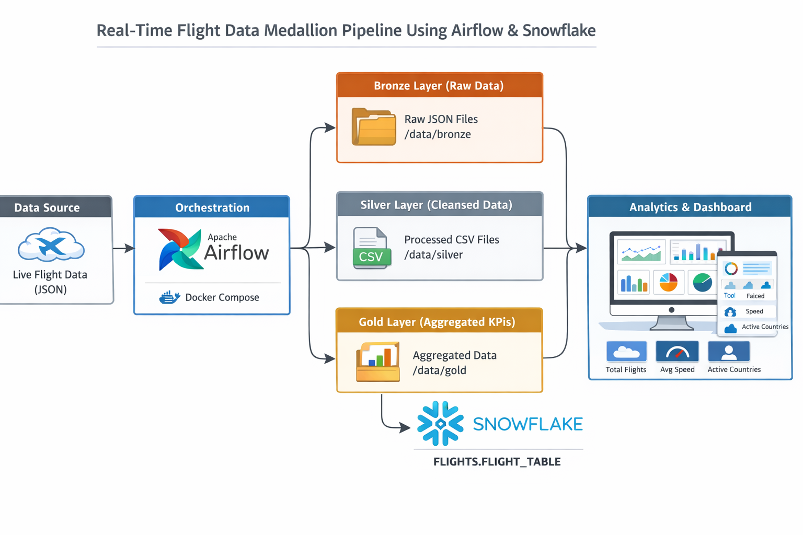

# Real-Time Flight Data Engineering — Airflow + Snowflake

An Airflow DAG that polls the [OpenSky Network](https://opensky-network.org/) live flight-state API every 30 minutes, runs it through a bronze/silver/gold medallion pipeline with an explicit data quality gate, and loads curated aggregates into Snowflake through a staging → analytics schema.

`flight_pipeline_v2/` is the only maintained version of this project.

## Architecture



```
cleanup_stale_bronze >> bronze_ingest >> silver_transform >> data_quality_check
   >> gold_layer >> snowflake_load >> generate_dashboard
```

- **Bronze** — raw OpenSky JSON, zero validation by design, so any stage can be re-run against a fixed snapshot without re-hitting a live API.
- **Silver** — dedups, drops invalid/stale/implausible readings, casts explicit dtypes.
- **Data quality gate** — asserts on row count, schema, uniqueness, and nullability before anything downstream sees the data.
- **Gold** — 5-minute `(window_start, origin_country)` traffic aggregates.
- **Snowflake load** — idempotent `MERGE` into `STAGING`, queried through `ANALYTICS` views.
- **Dashboard** — self-contained HTML report generated from `ANALYTICS`, written to `data/dashboard/latest.html`.

## Getting started

```bash
cd flight_pipeline_v2
cp .env.example .env       # fill in your own values; .env is gitignored
docker compose up -d       # Airflow UI at localhost:8080
pip install -r requirements-dev.txt
pytest tests/ -v
```

Run `scripts/snowflake_schema.sql` in a Snowflake worksheet once, then add a `flight_snowflake` Airflow Connection and (optionally) a `SLACK_WEBHOOK_URL` Variable for failure alerts.

## Docs

- [`flight_pipeline_v2/README.md`](flight_pipeline_v2/README.md) — full run guide, project structure, and design-decision rationale
- [`documentation/DOCUMENTATION.md`](documentation/DOCUMENTATION.md) — environment setup, DAG details, Snowflake schema, and dashboard/analysis queries

## License

[MIT](LICENSE)
